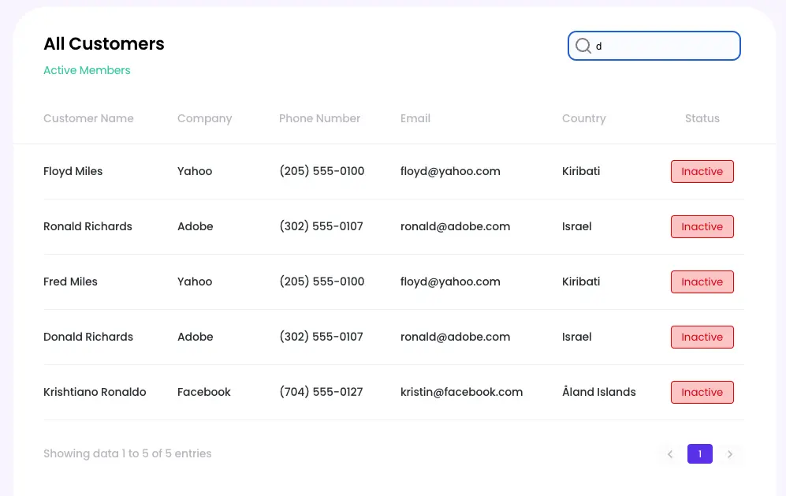

<h1 align="center">Dashboard Test App</h1>

Даний додаток - це тестове завдання, яке імітує сторінку з інформаційними панелями.

У завданні використовувалися такі технологіЇ:

- HTML5,
- SCSS,
- JavaScript,
- React.js,
- React Router.

Всі зображення були оптимізовані за допомогою Squoosh https://squoosh.app/

<h3 align="center">MainPage</h3>

Це стартова сторінка, на якій є привітання та SideBar меню з лівої сторони.

<h3 align="center">Customers</h3>

Це компонент, на якому відображаються контакти та їхня інформація.

Тут є також пошук контактів за полем Customer Name та працює пагінація.

<h3 align="center">Mobile version</h3>

Також існує мобільна версія сторінки.

Тут боковий SideBar замінений для зручності використання бургер-меню з окремим модальним вікном, яке закривається при натисканні на кнопку закриття, при виборі категорії або натисканні поза межами вікна.

**Використання прикладу:**

1.  Встановити всі залежності за допомогою команди npm install .
2.  Запустити додаток за допомогою команди npm start .
    Додаток буде доступний у браузері за адресою http://localhost:3000.
